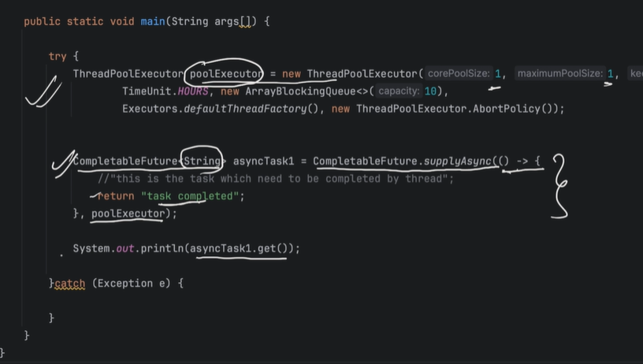
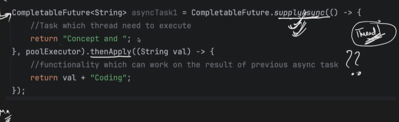
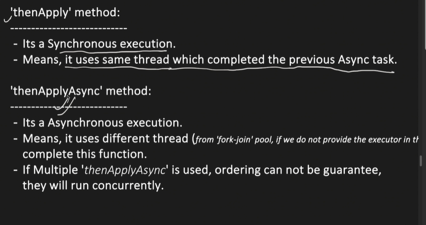
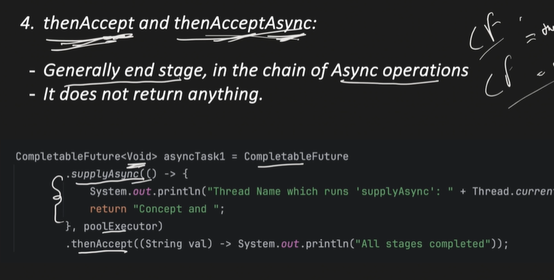
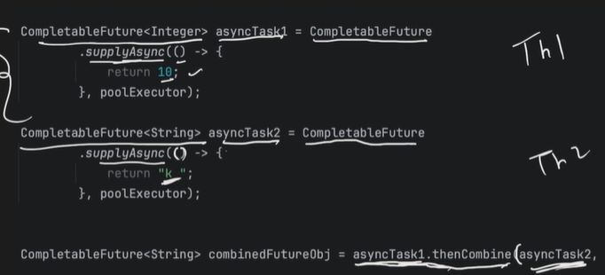
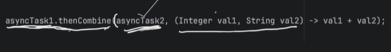

## Future:
- Interface which represents the result of the async task means it allows to check if computation is complete, get the result, take care of exception if any, etc
- Whenever we submit any task to the ThreadPoolExecutor, it returns a Future object

## Callable
-  Callable represents the task which need to be executed just like Runnable.
- But difference is:
- Runnable do not have any return type
- Callable has the capability of return the value

## CompletableFuture
- Help in async programming
- we can considered it as an advanced version of Future which provides additional capability like chaning

### Functions in CompletableFuture

#### supplyAsync()
 

#### thenApply & thenApplyAsync
- Apply a function to the result of previous Async computation
- Return a new CompletableFuture object

#### thenCompose and then ComposeAsync
- Chaning together dependent Async operations
- Means when next Async operation depends on the result of the previous async operation. We can tied them together
- For async tasks, we can bring some Ordering using this

#### thenAccept and thenAcceptAsync

#### thenCombine and thenCombineAsync
- Used to combine the result of 2 Completable Future

